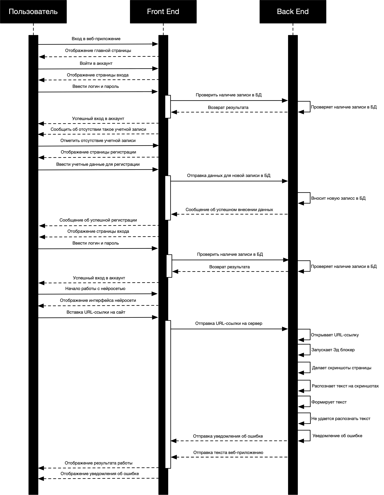

# easyText
это программное обеспечение, спроектированное для распознавания текста с сайтов

# Учасники проекта: 
Ерохин Андрей, Тимошенко Василий, Аванесов Артем, Артищев Роман, Аюпов Арсен, Артюхович Иван

# Документация к проекту

## Диаграмма последовательностей


## ERD диаграмма


## Запуск
```bash
git clone https://github.com/cherrveer/easy-text.git
cd easyText
docker system prune -fa --volumes # удалить прошлые билды
docker compose up --build --force-recreate # создать новый билд
Ctrl-C # после запуска закрыть
docker compose up # запустить заново
# сделать один запрос чтобы установились адблоки
```
